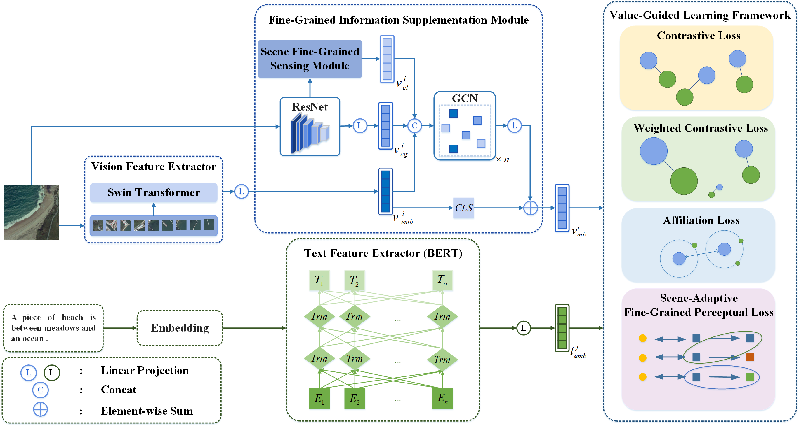

# 多模态时空大数据智能融合与挖掘技术算法及数据资源库
本算法库包含了一系列开源时空大数据智能融合与挖掘技术算法及其涉及的数据集。

## 目录

- [算法](#算法)
  - [Fine-Grained Information Supplementation and Value-Guided Learning for Remote Sensing Image-Text Retrieval](#Fine-Grained Information Supplementation and Value-Guided Learning for Remote Sensing Image-Text Retrieval)
  - [Multi-modal transformer using two-level visual features for fake news detection](#Multi-modal transformer using two-level visual features for fake news detection)
  - [An Enhanced Light Object Detection for Indiscernible Object in the Special Scene](#An Enhanced Light Object Detection for Indiscernible Object in the Special Scene)
- [数据集](#数据集)
- [致谢](#致谢)

## 算法
### Fine-Grained Information Supplementation and Value-Guided Learning for Remote Sensing Image-Text Retrieval（sci2）
本工作提出了一种细粒度信息补充与价值引导学习（fine-grained information supplementation and value-guided learning, FISVL）模型，通过融合推荐系统领域的先验知识进行特征增强，并采用价值导向的训练策略学习细粒度、高表达性与鲁棒性兼具的特征表示。具体而言，本工作设计了以下核心模块：
1. **细粒度信息补充模块（fine-grained information supplementation, FGIS）**：通过融合全局与局部特征的视觉信息，增强模型对遥感图像多尺度特征的感知能力，解决传统方法中因特征粒度不足导致的表征局限性问题。
​2. **双重损失优化机制**：针对模态内相似性过高的问题，提出加权对比损失（加权策略参考了样本重要性动态调整方法）与场景自适应细粒度感知损失，通过约束特征空间分布提升模型判别力。
​3. **价值引导学习框架**：在训练阶段动态聚焦关键信息，通过自适应的注意力机制（类似场景自适应门单元设计）优化不同训练阶段的学习目标优先级，显著提升模型收敛效率。
本工作在RSICD与RSITMD数据集上验证了模型的有效性，结果表明本方法在细粒度特征学习与跨模态对齐任务中均达到领先水平。

* 引用
```bibtex
@article{zhou2024fine,
  title={Fine-Grained Information Supplementation and Value-Guided Learning for Remote Sensing Image-Text Retrieval},
  author={Zhou, Zihui and Feng, Yong and Qiu, Agen and Duan, Guofan and Zhou, Mingliang},
  journal={IEEE Journal of Selected Topics in Applied Earth Observations and Remote Sensing},
  year={2024},
  publisher={IEEE}
}
```

* 代码链接：

### Multi-modal transformer using two-level visual features for fake news detection（sci2）

* 引用
```bibtex
@article{wang2022multi,
  title={Multi-modal transformer using two-level visual features for fake news detection},
  author={Wang, Bin and Feng, Yong and Xiong, Xian-cai and Wang, Yong-heng and Qiang, Bao-hua},
  journal={Applied Intelligence},
  year={2022},
  publisher={Springer}
}
```
* 代码链接：https://github.com/cqu-wb/MTTV

### An Enhanced Light Object Detection for Indiscernible Object in the Special Scene（sci4）
* 引用
```bibtex
@article{zhang2022enhanced,
  title={An Enhanced Light Object Detection for Indiscernible Object in the Special Scene},
  author={Zhang, Quanyou and Feng, Yong and Wang, Yong-heng and Qiang, Bao-hua and Wang, Lufeng and Zhang, Zebin},
  journal={Journal of Engineering Research},
  year={2022}
}
```
* 代码链接：https://github.com/zhangquanyou/SAT

## 致谢
本项目受益于 [PEFT](https://github.com/huggingface/peft)、[TRL](https://github.com/huggingface/trl)、[QLoRA](https://github.com/artidoro/qlora) 和 [FastChat](https://github.com/lm-sys/FastChat)，感谢以上诸位作者的付出。
