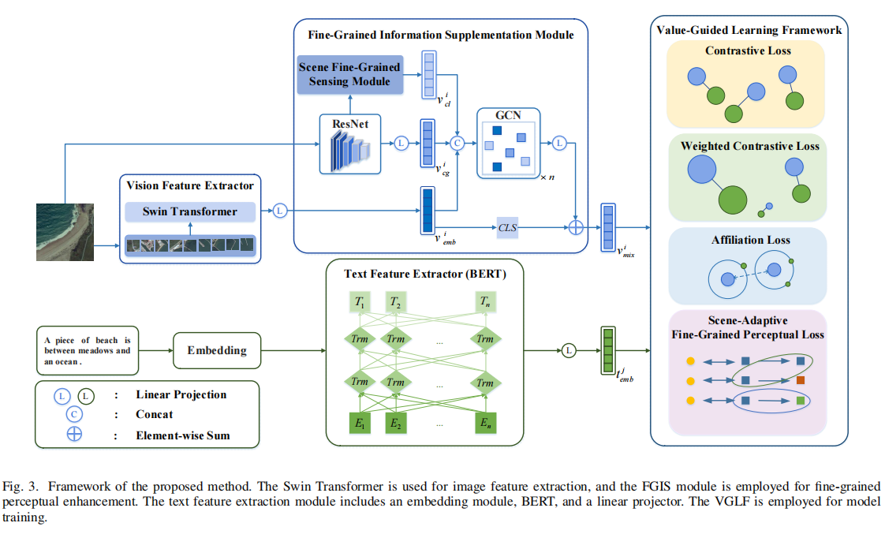
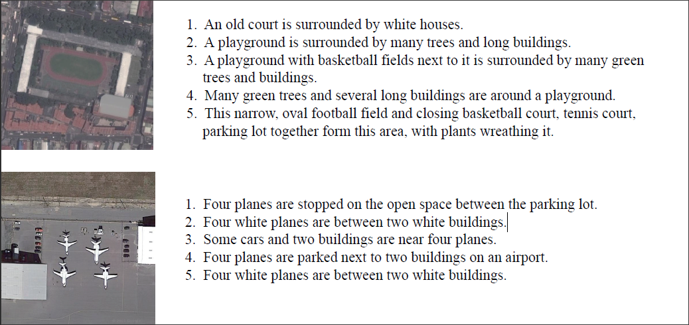

# 时空大数据智能融合与挖掘技术算法库
本算法库包含了一系列开源时空大数据智能融合与挖掘技术算法。

## 目录

- [算法](#算法)
  - [Fine-Grained Information Supplementation and Value-Guided Learning for Remote Sensing Image-Text Retrieval](#fine-grained-information-supplementation-and-value-guided-learning-for-remote-sensing-image-text-retrieval)
  - [DMA-YOLO: multi-scale object detection method with attention mechanism for aerial images](#dma-yolo-multi-scale-object-detection-method-with-attention-mechanism-for-aerial-images)
  - [Multi-Level Network Based on Transformer Encoder for Fine-Grained Image–Text Matching](#multi-level-network-based-on-transformer-encoder-for-fine-grained-image–text-matching)
  - [Manifold and Patch-Based Unsupervised Deep Metric Learning for Fine-Grained Image Retrieval](#manifold-and-patch-based-unsupervised-deep-metric-learning-for-fine-grained-image-retrieval)
- [数据集](#数据集)
  - [RSITMD](#RSITMD)
  - [RSICD](#RSICD)
  - [VisDrone2019](#VisDrone2019)
  - [UAVDT](#UAVDT)

## 算法
### Fine-Grained Information Supplementation and Value-Guided Learning for Remote Sensing Image-Text Retrieval
本工作提出了一种细粒度信息补充与价值引导学习（fine-grained information supplementation and value-guided learning, FISVL）模型，通过融合推荐系统领域的先验知识进行特征增强，并采用价值导向的训练策略学习细粒度、高表达性与鲁棒性兼具的特征表示。具体而言，本工作设计了以下核心模块：
1. ​**细粒度信息补充模块（fine-grained information supplementation, FGIS）​**：通过融合全局与局部特征的视觉信息，增强模型对遥感图像多尺度特征的感知能力，解决传统方法中因特征粒度不足导致的表征局限性问题。
2. ​**双重损失优化机制**：针对模态内相似性过高的问题，提出加权对比损失（加权策略参考了样本重要性动态调整方法）与场景自适应细粒度感知损失，通过约束特征空间分布提升模型判别力。
3. ​**价值引导学习框架**：在训练阶段动态聚焦关键信息，通过自适应的注意力机制（类似场景自适应门单元设计）优化不同训练阶段的学习目标优先级，显著提升模型收敛效率。
本工作在RSICD与RSITMD数据集上验证了模型的有效性，结果表明本方法在细粒度特征学习与跨模态对齐任务中均达到领先水平。

* 模型效果
  


* 引用
```bibtex
@article{zhou2024fine,
  title={Fine-Grained Information Supplementation and Value-Guided Learning for Remote Sensing Image-Text Retrieval},
  author={Zhou, Zihui and Feng, Yong and Qiu, Agen and Duan, Guofan and Zhou, Mingliang},
  journal={IEEE Journal of Selected Topics in Applied Earth Observations and Remote Sensing},
  year={2024},
  publisher={IEEE}
}
```
* 代码请见[FISVL-pytorch](FISVL-pytorch.zip)

### DMA-YOLO multi-scale object detection method with attention mechanism for aerial images
本工作对通用目标检测方法YOLOv5进行了改进，引入了一种多尺度检测方法分离-合并注意力YOLO（Detach-Merge Attention YOLO, DMA-YOLO）。具体来说，本工作提出了一个分离-合并卷积（Detach-Merge Convolution, DMC）模块，并将其嵌入到骨干网络中，以最大限度地保留特征。此外，本工作将瓶颈注意力模块（Bottleneck Attention Module, BAM）嵌入到检测头中，在不显著增加计算复杂度的情况下抑制复杂背景信息的干扰。为了更有效地表示和处理多尺度特征，本工作将一个额外的检测头和增强的颈部网络集成到双向特征金字塔网络（Bi-directional Feature Pyramid Network, BiFPN）结构中。最后，本工作采用SCYLLA-IoU（SIoU）作为损失函数以加快模型的收敛速度、提高精度。本工作在VisDrone2019和UAVDT数据集上验证了模型的效果。

* 模型效果

<div align="center">
  
</div>
<div align="center">
  
</div>


* 引用
```bibtex
@article{li2024dma,
  title={DMA-YOLO: multi-scale object detection method with attention mechanism for aerial images},
  author={Li, Ya-ling and Feng, Yong and Zhou, Ming-liang and Xiong, Xian-cai and Wang, Yong-heng and Qiang, Bao-hua},
  journal={The Visual Computer},
  volume={40},
  number={6},
  pages={4505--4518},
  year={2024},
  publisher={Springer}
}
```
* 代码请见[DMA-YOLO](DMA-YOLO.zip)

### Multi-Level Network Based on Transformer Encoder for Fine-Grained Image–Text Matching

* 模型效果

* 引用
```bibtex
@article{yang2023multi,
  title={Multi-level network based on transformer encoder for fine-grained image--text matching},
  author={Yang, Lei and Feng, Yong and Zhou, Mingliang and Xiong, Xiancai and Wang, Yongheng and Qiang, Baohua},
  journal={Multimedia Systems},
  volume={29},
  number={4},
  pages={1981--1994},
  year={2023},
  publisher={Springer}
}
```
* 代码请见[JGDN](https://github.com/CQULab/JGDN)

### Manifold and Patch-Based Unsupervised Deep Metric Learning for Fine-Grained Image Retrieval

## 数据集
### RSITMD
RSITMD的图像来自RSICD和谷歌Earth，共包含4743张，分辨率为`256 X 256`。每张图片包含5个相应的文本，共计23715。数据集中的所有图像被分为32类。与RSICD相比，RSITMD具有更细粒度的文本描述和更丰富的场景变化。

点击查看[数据集链接](https://github.com/AICyberTeam/AMFMN/blob/main/RSITMD/README.md)。
### RSICD
RSICD数据集包括从百度地图、谷歌Earth、MapABC和Tianditu收集的10921张图片。数据集中的图像被分为30类，包括机场、森林、池塘等。每张图像是`224 X 224`的形状，与5个相应的句子匹配。

点击查看[数据集链接](https://github.com/201528014227051/RSICD_optimal)。
### VisDrone2019
VisDrone2019数据集包含10209张高分辨率图像，划分如下：​6471张训练图像、548张验证图像和3190张测试图像。图像分辨率为`2000 X 1500`像素，涵盖无人机在不同飞行高度拍摄的多样化场景。这些图像是使用不同的无人机摄像机拍摄的，包括多样的位置属性（来自中国14个相距数千公里的不同城市）、环境条件（城市和农村景观）、对象类型（如行人、车辆、自行车等）和场景密度（包括稀疏和拥挤的场景）。

点击查看[数据集链接](https://github.com/VisDrone/VisDrone-Dataset)。
### UAVDT
UAVDT数据集用于航空图像的检测和跟踪。数据集由100个视频序列组成，总共有80000帧，平均分辨率为`1080 X 540`。这些视频包含了多种多样的场景和包括汽车、公共汽车、卡车在内的车辆。

点击查看[数据集链接](https://pan.baidu.com/s/1Vts7V-6JYd395vL6mVYMFQ#list/path=%2F)。
